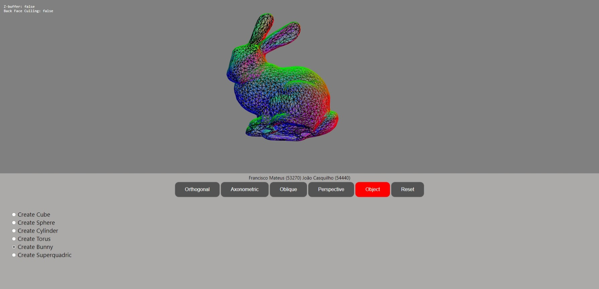

# Object views

This project was carried out within the scope of the Computer Graphics and Interfaces (CGI) course at the Faculty of Science and Technology of the NOVA University of Lisbon. It was the second project carried out in this course at the academic year of 2019/2020.

##### Authors:
- Francisco Mateus
- João Casquilho

##### Github pages url: https://ftmateus.github.io/CGI_Proj2_FM_JC/